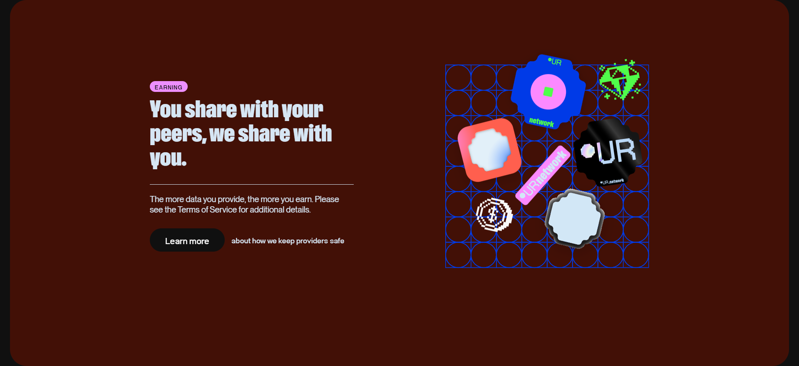

# Docker-UrNetwork
A minimal Docker setup that automatically fetches, updates, and runs the latest urNetwork Provider.  The container is built on **Alpine Linux**, ensuring a minimal footprint. Includes built-in authentication handling, resilient restarts, scheduled in‑container updates (nightly build), and network diagnostics.  

## Build
- UrNetwork_stable v2025.12.30-823338960
- UrNetwork_nightly v2026.2.8-858138120

## Links
| DockerHub | GitHub | Invite |
|----------|----------|----------|
| [](https://hub.docker.com/r/techroy23/docker-urnetwork) | [](https://github.com/techroy23/Docker-UrNetwork) | [](https://ur.io/c?bonus=0MYG84) |

## Features
- Automated retrieval of the latest urNetwork Provider binary on startup (nightly build)
- Scheduled update watcher (default at 12:00 Asia/Manila) (nightly build)
- Secure credential management via environment variables
- Alpine-based image for minimal footprint
- Persistent storage of authentication tokens and version metadata
- Resilient provider execution with automatic retries and re-authentication
- Built-in network diagnostic script (urnetwork_ipinfo.sh)

## Environment variables
| Variable | Requirement | Description |
|:--------:|:-----------:|-------------|
| `-e BUILD='stable'`<br />`-e BUILD='nightly'`<br />`-e BUILD='jwt'` | Optional | **stable** The latest officially tested release. Prioritized for reliability and long-term use.<br /><br />**nightly** The most recent development snapshot. Includes new features and fixes but may be unstable.<br /><br />Default is **stable** |
| `-e USER_AUTH <EMAIL>`<br />and<br />`-e PASSWORD <PASSWORD>`  | Required for<br />**stable**/**nightly**<br />build | Your Email and Password.<br />The container will exit if not provided. |
| `<AUTH-CODE>` | Required for<br />**jwt**<br />build | Your authentication code.<br />The container will exit if not provided.<br />Generate one here: https://ur.io/ |
| `-e ENABLE_IP_CHECKER` | Optional | Boolean **true**/**false**<br /><br />Checks and prints your public IPv4 address to stdout visible directly in Docker logs for easy monitoring.<br /><br />Default is False.|
| `-v /path/to/your/proxy.txt:/app/proxy.txt`  | Optional | Mount a proxy configuration file from host to container.<br />Omit this line entirely if you don't want to use a proxy.<br />The proxy inside the proxy.txt should have this format ip:port:username:password.<br />See the sample below. one proxy per line. |
| | Optional | `123.456.789.012:55555:myproxyusername:myproxypassword`<br />`234.567.890.123:44444:myproxyusername:myproxypassword`<br />`345.678.901.234:33333:myproxyusername:myproxypassword`<br />`456.789.012.345:22222:myproxyusername:myproxypassword`<br />`567.890.123.456:11111:myproxyusername:myproxypassword` |
| `-e ENABLE_VNSTAT` | Optional | Boolean **true**/**false**<br /><br />A lightweight tool that logs and reports network bandwidth usage.<br /><br />Default is True. |
| `-v vnstat_data:/var/lib/vnstat`<br />`-p 8080:8080` | Optional | Stats JSON Portal = `http://localhost:port/cgi-bin/stats` <br />Mounts a docker volume `vnstat_data` to `/var/lib/vnstat`. <br />Mounting it ensures data history persists across restarts or image updates. <br />Each instance needs its own volume and port to avoid overwriting each other’s data.<br />See the sample below. |
| | Optional | `-v vnstat_data1:/var/lib/vnstat`  # for first container <br />`-p 9001:8080   # Host port 9001`  # for first container <br />`-v vnstat_data2:/var/lib/vnstat`  # for second container <br />`-p 9002:8080   # Host port 9002`  # for second container |

## Run with username/password
```sh
# Option 1 : amd64 build
docker run -d --platform linux/amd64 \
  --name=urnetwork \
  --cpus=0.25 --pull=always --restart=always \
  --log-driver=json-file --log-opt max-size=1m --log-opt max-file=1 \
  --cap-add=NET_ADMIN --cap-add=NET_RAW --sysctl net.ipv4.ip_forward=1 \
  -e BUILD='stable' \
  -e USER_AUTH='example@gmail.com' \
  -e PASSWORD='mYv3rYsEcUr3dP@sSw0rD' \
  -e ENABLE_IP_CHECKER=false \
  -v /path/to/your/proxy.txt:/app/proxy.txt \
  -e ENABLE_VNSTAT=true \
  -v vnstat_data:/var/lib/vnstat \
  -p 8080:8080 \
  techroy23/docker-urnetwork:latest

# Option 2 : arm64 build
docker run -d --platform linux/arm64 \
  --name=urnetwork \
  --cpus=0.25 --pull=always --restart=always \
  --log-driver=json-file --log-opt max-size=1m --log-opt max-file=1 \
  --cap-add=NET_ADMIN --cap-add=NET_RAW --sysctl net.ipv4.ip_forward=1 \
  -e BUILD='stable' \
  -e USER_AUTH='example@gmail.com' \
  -e PASSWORD='mYv3rYsEcUr3dP@sSw0rD' \
  -e ENABLE_IP_CHECKER=false \
  -v /path/to/your/proxy.txt:/app/proxy.txt \
  -e ENABLE_VNSTAT=true \
  -v vnstat_data:/var/lib/vnstat \
  -p 8080:8080 \
  techroy23/docker-urnetwork:latest
```

## Run with JWT
- Do not set `restart` to `always`, as this may cause account lockouts.
- Replace `<AUTH-CODE>` with the code you generated from https://ur.io/
```sh
# Option 1 : amd64 build
docker run -d --platform linux/amd64 \
  --name=urnetwork \
  --cpus=0.25 --pull=always \
  --log-driver=json-file --log-opt max-size=1m --log-opt max-file=1 \
  --cap-add=NET_ADMIN --cap-add=NET_RAW --sysctl net.ipv4.ip_forward=1 \
  -e BUILD='jwt' \
  -e ENABLE_IP_CHECKER=false \
  -v /path/to/your/proxy.txt:/app/proxy.txt \
  -e ENABLE_VNSTAT=true \
  -v vnstat_data:/var/lib/vnstat \
  -p 8080:8080 \
  techroy23/docker-urnetwork:latest <AUTH-CODE>

# Option 2 : arm64 build
docker run -d --platform linux/arm64 \
  --name=urnetwork \
  --cpus=0.25 --pull=always \
  --log-driver=json-file --log-opt max-size=1m --log-opt max-file=1 \
  --cap-add=NET_ADMIN --cap-add=NET_RAW --sysctl net.ipv4.ip_forward=1 \
  -e BUILD='jwt' \
  -e ENABLE_IP_CHECKER=false \
  -v /path/to/your/proxy.txt:/app/proxy.txt \
  -e ENABLE_VNSTAT=true \
  -v vnstat_data:/var/lib/vnstat \
  -p 8080:8080 \
  techroy23/docker-urnetwork:latest <AUTH-CODE>
```

## Promo Video
<div align="center">
  <a href="https://www.youtube.com/watch?v=E1tXbiLSU2I">
    
  </a>
</div>

## Promo
<ul><li><a href="https://ur.io/c?bonus=0MYG84"> [ REGISTER HERE ] </a></li></ul>
<div align="center">
  <a href="https://ur.io/c?bonus=0MYG84">
    
  </a>
</div>
