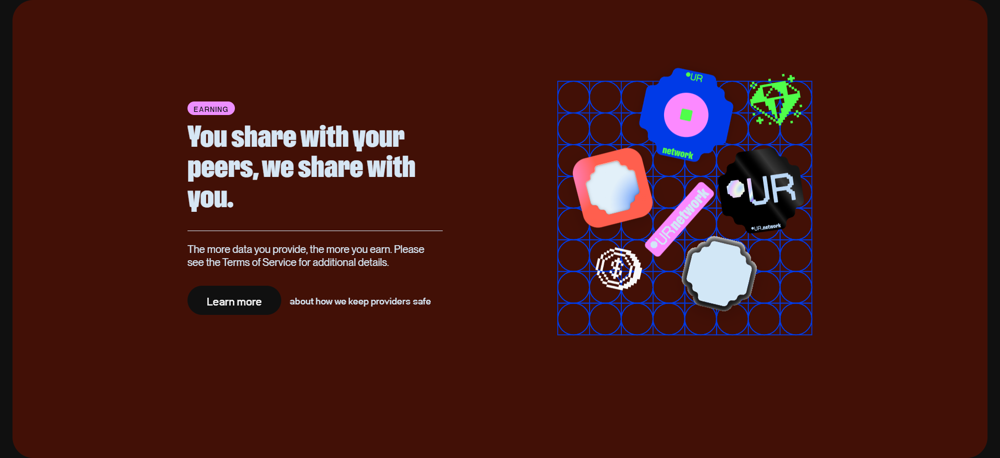

# Docker-UrNetwork
A **lightweight, automated Docker setup** for deploying the **urNetwork Provider**. It dynamically fetches the latest release from GitHub, extracts binaries, manages authentication through environment variables, and runs the provider in the background. The container is built on **Alpine Linux**, ensuring a minimal footprint while including essential system tools for network diagnostics.
   
## Features  
- **Automated Provider Deployment**: Dynamically fetches and extracts the latest release from GitHub.  
- **Secure Authentication Handling**: Uses environment variables `USER_AUTH` and `PASSWORD`.  
- **Compact & Efficient**: Alpine-based container for minimal resource usage.  
- **Integrated Network Diagnostics**: Includes tools like `netstat` for monitoring.  
- **Resilient Execution**: Keeps the provider running continuously to avoid premature container exits.  

## Run
```sh

# Option 1 : amd64 build
docker run -d --platform linux/amd64 \
  --cap-add NET_ADMIN
  -e USER_AUTH="Your-Email@here.com" \
  -e PASSWORD="YourPassword" \
  ghcr.io/techroy23/docker-urnetwork:latest

# Option 2 : arm64 build
docker run -d --platform linux/arm64 \
  --cap-add NET_ADMIN
  -e USER_AUTH="Your-Email@here.com" \
  -e PASSWORD="YourPassword" \
  ghcr.io/techroy23/docker-urnetwork:latest

# Tip: For better privacy and reliability, consider setting up your **own DNS resolver** (e.g., Unbound or CoreDNS)
# and point `TARGETDNS` to that instead of using public resolvers.
# This avoids data leakage and gives you more control.

```

## Promo Video
<div align="center">
  <a href="https://www.youtube.com/watch?v=E1tXbiLSU2I">
    
  </a>
</div>

## Promo
<ul><li><a href="https://ur.io/c?bonus=0MYG84"> [ REGISTER HERE ] </a></li></ul>
<div align="center">
  <a href="https://ur.io/c?bonus=0MYG84">
    
  </a>
</div>
